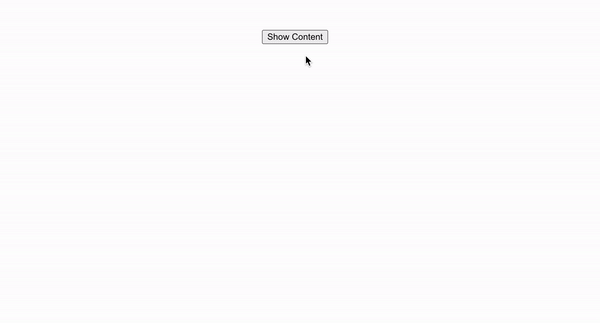

# useOutsideClick-Custom-Hook-Project

import { useEffect } from "react";

export default function useOutsideClick(ref, handler) {
  useEffect(() => {
    function listener(event) {
      if (!ref.current || ref.current.contains(event.target)) {
        return;
      }
      handler(event);
    }
    document.addEventListener("mousedown", listener);
    document.addEventListener("touchstart", listener);

    return () => {
      document.removeEventListener("mousedown", listener);
      document.removeEventListener("touchstart", listener);
    };
  }, [ref, handler]);
}

---------------

import React, { useRef, useState } from "react";
import "./styles.css";
import useOutsideClick from "./useOutsideClick";

export default function UseOutsideClickTest() {
  const [showContent, setShowContent] = useState(false);
  const ref = useRef();
  useOutsideClick(ref, () => setShowContent(false));

  return (
    

      {showContent ? (
        

          <h1>This is random content</h1>
          

            Please click outside of this content to close Lorem ipsum dolor, sit
            amet consectetur adipisicing elit. Quae possimus ipsam dolorem
            commodi dolorum non iste eum natus suscipit, quo animi aliquam
            minima assumenda esse? Minima corrupti quisquam ab cumque!
          

        

      ) : (
        <button
          className="modalContentBtn"
          onClick={() => setShowContent(true)}
        >
          Show Content
        </button>
      )}
    

  );
}
